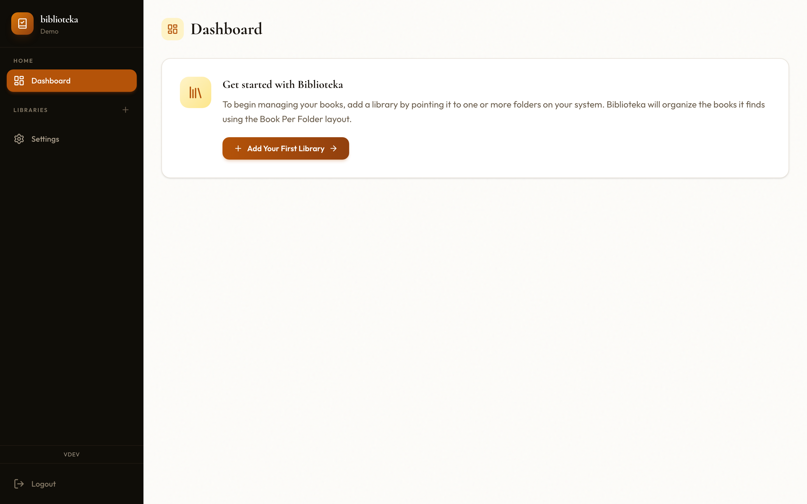
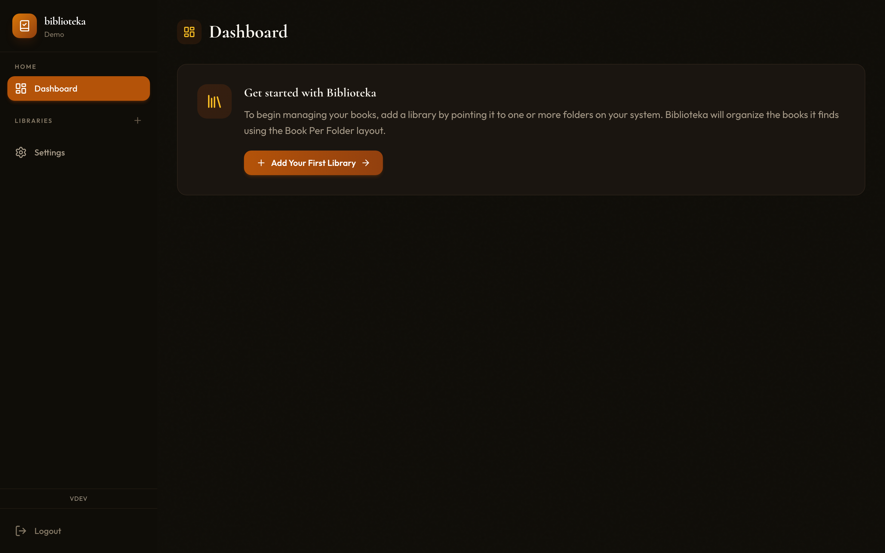
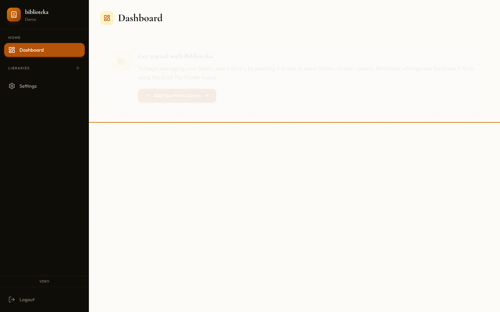
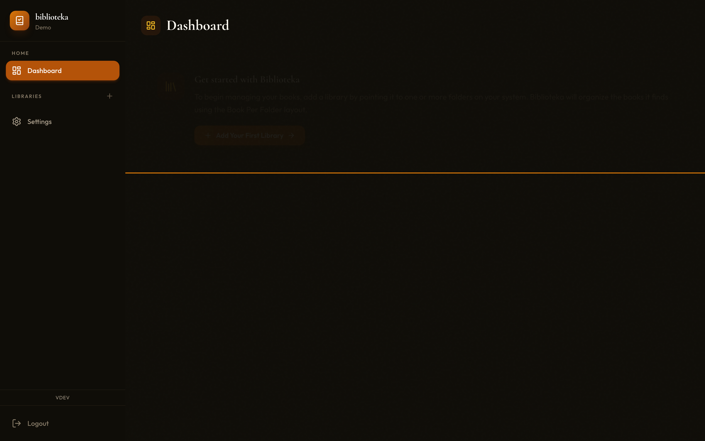
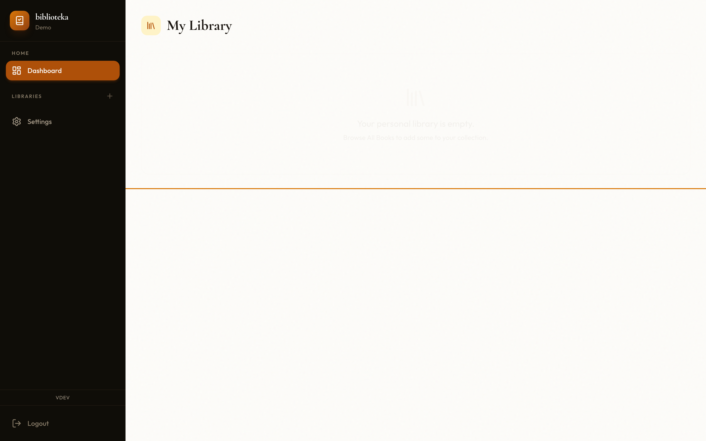
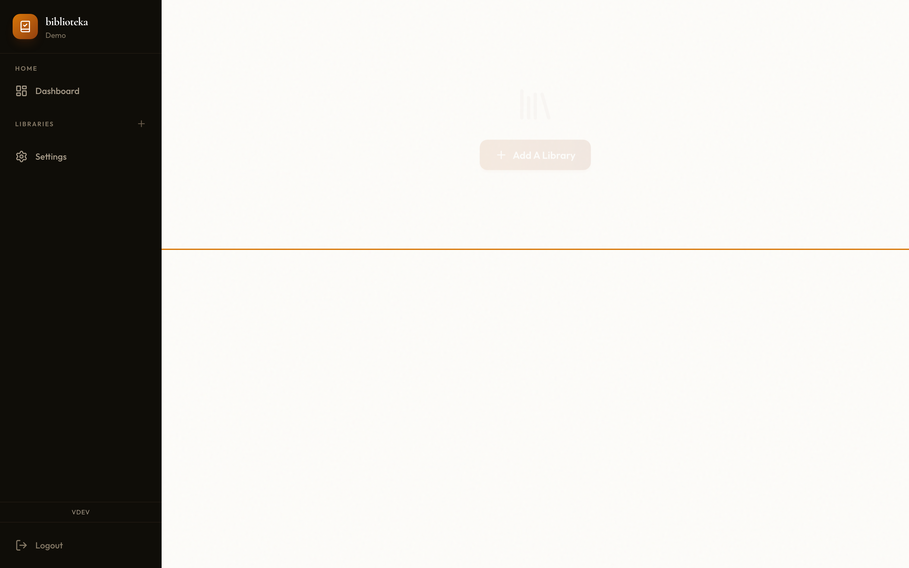
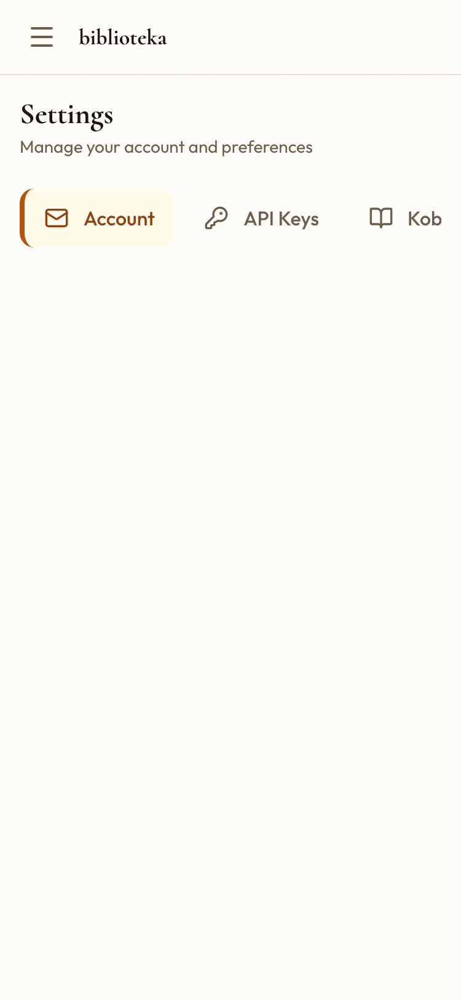

# Biblioteka

A self-hosted personal book library manager. Scan local files, extract metadata, and browse your e-book and physical book collection through a clean web interface.

## Features

- **Multi-format support** – EPUB, MOBI, AZW3, and PDF
- **Metadata extraction** – title, author, ISBN, description, publisher, language, and publication date extracted automatically during library scans via [ExifTool](https://exiftool.org/) (all supported formats: EPUB, MOBI, AZW3, PDF); extracted authors are linked to book records automatically; standalone [`cmd/cli`](#cli-tool) tool available for manual import, directory scanning, and metadata inspection
- **Path-based metadata** – when files are organized in `Author/Title/` or `Author - Title` directory layouts, Biblioteka automatically derives author, title, series name, and series position from the directory structure, supplementing any embedded file metadata; trailing `(YYYY)` year tokens are also stripped to keep titles clean (the year is not stored as `publication_date`)
- **File organisation** – per-library `organization_type` setting controls how imported files are arranged: `book_per_folder` (`Author/Title/file`), `book_per_file` (`Author/file`), or `none` (leave as-is); see [Administration → File organization](docs/administration.md#file-organization)
- **Sidecar files** – on every import, Biblioteka writes a `metadata.opf` ([OPF 2.0](https://idpf.org/epub/20/spec/OPF_2.0.1_draft.htm)) file alongside the book file, and a cover image (`cover.jpg`, `cover.png`, etc.) when one is available (EPUB only); these files are compatible with Calibre, KOReader, Kobo, and other tools; see [Administration → Sidecar files](docs/administration.md#sidecar-files)
- **Library organisation** – group books into multiple named libraries with configurable file-system paths
- **Author & series tracking** – browse by author or series, with position numbers within each series
- **User authentication** – JWT-based login, optional OpenID Connect (OIDC/SSO)
- **API keys** – Long-lived tokens for programmatic and scripted access (prefix `bib_`); managed per-user via the Settings page or API
- **OPDS 1.2 catalog** – Built-in OPDS server at `/opds` lets any compatible e-reader app (KOReader, Calibre, Moon+ Reader, …) browse and download books using Basic Auth credentials separate from your main account password
- **Kobo e-reader sync** – Native Kobo device API at `/kobo/<token>/` syncs your library and reading progress to Kobo e-readers; create per-device tokens from **Settings → Kobo Sync** or via the API
- **KOReader reading progress sync** – [kosync](https://github.com/koreader/koreader-sync-server)-compatible API at `/api/syncs/progress` syncs reading positions from KOReader to Biblioteka; set up dedicated KOSync credentials via the API
- **Background processing** – Redis-backed job queue scans paths and processes files asynchronously; includes a built-in [Asynqmon](https://github.com/hibiken/asynqmon) monitoring UI at `/asynqmon/`
- **Two database backends** – SQLite (zero-config, default) or PostgreSQL
- **Single binary** – Go backend embeds the Svelte frontend; one executable to deploy

## Screenshots

<table>
  <tr>
    <td align="center"><strong>Dashboard — light</strong></td>
    <td align="center"><strong>Dashboard — dark</strong></td>
  </tr>
  <tr>
    <td></td>
    <td></td>
  </tr>
  <tr>
    <td align="center"><strong>Books — light</strong></td>
    <td align="center"><strong>Books — dark</strong></td>
  </tr>
  <tr>
    <td></td>
    <td></td>
  </tr>
  <tr>
    <td align="center"><strong>My Library — light</strong></td>
    <td align="center"><strong>My Library — dark</strong></td>
  </tr>
  <tr>
    <td></td>
    <td></td>
  </tr>
  <tr>
    <td align="center"><strong>Libraries — light</strong></td>
    <td align="center"><strong>Libraries — dark</strong></td>
  </tr>
  <tr>
    <td></td>
    <td></td>
  </tr>
  <tr>
    <td align="center"><strong>Settings (mobile) — light</strong></td>
    <td align="center"><strong>Settings (mobile) — dark</strong></td>
  </tr>
  <tr>
    <td></td>
    <td></td>
  </tr>
</table>

## Tech Stack

| Layer | Technology |
|---|---|
| Backend | Go 1.26, `net/http` |
| Frontend | Svelte 5, TypeScript, Tailwind CSS 3.4, Vite 7 |
| Database | SQLite (default) · PostgreSQL |
| Job queue | asynq (Redis) |
| Auth | JWT · OIDC |
| Observability | OpenTelemetry (tracing + structured logging) |

## Quick Start

### Docker Compose (recommended)

Pre-built multi-arch images (`linux/amd64`, `linux/arm64`) are published to the GitHub Container Registry on every push to `main` and on every release. To use them instead of building from source, set the `image:` key in a `docker-compose.override.yml`:

```yaml
# docker-compose.override.yml
services:
  biblioteka:
    image: ghcr.io/amalgamated-tools/biblioteka:latest
    build: null   # disable local build
```

Available image tags:

| Tag | When updated | Use for |
|-----|-------------|---------|
| `latest` | Each release | Production |
| `edge` | Every push to `main` | Bleeding-edge / staging |
| `v<major>.<minor>` (e.g. `v0.1`) | Each release | Minor-version pin |
| `v<major>.<minor>.<patch>` | Each release | Exact-version pin |
| `sha-<short-sha>` | Every push to `main` | Reproducing a specific build |

```bash
# SQLite + Redis (simplest setup)
docker compose up -d
```

The application is available at <http://localhost:8080>.

For PostgreSQL, merge both compose files:

```bash
docker compose -f docker-compose.yml -f docker-compose.postgres.yml up -d
```

### Build from Source

**Prerequisites:** Go 1.26+, Node.js 22+, pnpm, Redis

```bash
git clone https://github.com/amalgamated-tools/biblioteka.git
cd biblioteka

# Build frontend then compile Go binary
make build

# Run
make run
```

### Development Mode (hot-reload)

```bash
# Install frontend dependencies
cd frontend && pnpm install && cd ..

# Check Redis is available
make redis-check

# Start backend (air) + frontend (Vite) together
make dev
```

The Go API runs on `http://localhost:8080`; Vite proxies `/api` requests to it.

## Configuration

Copy `.env.sample` to `.env` and adjust as needed. The `PORT` value can also be set via the `-port` flag when running the binary directly (e.g., `./biblioteka -port 9090`). Use the `-mode` flag to control which components start (see [Run Modes](#run-modes) below).

| Variable | Default | Description |
|---|---|---|
| `PORT` | `8080` | HTTP listen port (overrides `-port` flag) |
| `DATABASE_URL` | *(empty – SQLite)* | PostgreSQL connection string |
| `REDIS_URL` | `redis://localhost:6379` | Redis connection URL |
| `JWT_SECRET` | — | **Required in production** – random secret for signing tokens |
| `SECURE_COOKIES` | `true` | Marks session cookies as `Secure`. Set to `false` for local HTTP development (the provided `.env.sample` defaults to `false`) |
| `LOG_LEVEL` | `info` | `debug`, `info`, `warn`, `error` |
| `LOG_FORMAT` | `json` | `json` or `text` |
| `OIDC_ISSUER_URL` | *(empty)* | OIDC provider issuer URL |
| `OIDC_CLIENT_ID` | *(empty)* | OIDC client ID |
| `OIDC_CLIENT_SECRET` | *(empty)* | OIDC client secret |
| `OIDC_REDIRECT_URI` | `http://localhost:8080/api/auth/oidc/callback` | OIDC callback URL |
| `SMTP_HOST` | *(empty)* | SMTP server hostname or IP address. When set, all SMTP settings are read from environment variables and override any values stored in the database |
| `SMTP_PORT` | `587` | SMTP server port |
| `SMTP_USERNAME` | *(empty)* | SMTP authentication username (leave empty for unauthenticated relay) |
| `SMTP_PASSWORD` | *(empty)* | SMTP authentication password |
| `SMTP_FROM` | *(empty)* | Envelope `From` address for outgoing mail (e.g. `biblioteka@example.com`) |
| `SMTP_TLS` | `starttls` | TLS mode: `none`, `starttls`, or `tls` |
| `TELEMETRY_ENABLED` | `false` | Send anonymous usage telemetry on first startup (opt-in, disabled by default) |
| `TELEMETRY_ENDPOINT` | *(internal default)* | Override the anonymous telemetry collection endpoint |
| `POSTGRES_PASSWORD` | — | PostgreSQL password; used by the `docker-compose.postgres.yml` Docker Compose file |

## Admin

The first account created is automatically granted admin privileges. Admins can:

- **Manage users** — list all accounts and grant or revoke admin status via `GET /api/admin/users` and `PUT /api/admin/users/{id}`.
- **Configure OIDC at runtime** — read and update the OIDC provider settings via `GET /api/config/oidc` and `PUT /api/config/oidc` without a server restart. Environment variable values (`OIDC_ISSUER_URL`, etc.) take precedence over database-stored settings.
- **Configure SMTP at runtime** — read and update SMTP server settings via `GET /api/config/smtp` and `PUT /api/config/smtp` without a server restart. Send a test email via `POST /api/config/smtp/test` to verify the configuration. Environment variable values (`SMTP_HOST`, etc.) take precedence over database-stored settings when `SMTP_HOST` is set.
- **Monitor background jobs** — a web dashboard is available at `/asynqmon/` when Redis is running. It shows queued, active, completed, and failed job details.
- **Review audit logs** — a paginated audit trail of all create, update, and delete actions is available via `GET /api/audit-logs`. Each entry records the user (when available), the action, and the affected entity.

## OPDS Catalog

Biblioteka includes a built-in [OPDS 1.2](https://specs.opds.io/opds-1.2) catalog server, allowing any compatible e-reader to browse and download your books without extra software.

- **URL:** `/opds` (e.g. `http://localhost:8080/opds`)
- **Authentication:** HTTP Basic Auth using a per-user OPDS credential — separate from your main account password.
- **Manage credentials:** via `GET /api/opds/credentials` (check current credentials), `PUT /api/opds/credentials` (set or update), and `DELETE /api/opds/credentials` (remove) — all API-only; there is no Settings UI for OPDS credentials.

See [docs/opds.md](docs/opds.md) for the full setup guide, catalog structure, and supported OPDS clients.

## KOReader Sync

Biblioteka exposes a [kosync](https://github.com/koreader/koreader-sync-server)-compatible API so that [KOReader](https://koreader.rocks/) can sync reading positions to your self-hosted server.

- **API base:** `/api/syncs/progress`
- **Authentication:** KOSync credentials (username + password) managed separately from your main account via the API (see [docs/koreader.md](docs/koreader.md)).

See [docs/koreader.md](docs/koreader.md) for the full setup guide and API reference.

## API Keys

Long-lived API keys let scripts, CI pipelines, and external services authenticate without storing your password or managing JWT expiry. Keys begin with `bib_` and are supplied via the `Authorization: Bearer` header.

- **Create and revoke keys:** via **Settings → API Keys** in the UI, or via the `GET / POST /api/api-keys` and `DELETE /api/api-keys/{id}` endpoints.
- **Scope:** each key inherits the permissions of the user who created it.

See [docs/authentication.md#api-keys](docs/authentication.md#api-keys) for the full reference.

## Background Job Monitoring

When Redis is configured, Biblioteka embeds the [Asynqmon](https://github.com/hibiken/asynqmon) web UI for monitoring and managing background jobs.

- **URL:** `/asynqmon/` (e.g. `http://localhost:8080/asynqmon/` in the default local setup)
- **Authentication:** Requires a valid admin JWT, supplied either as an `Authorization: Bearer <token>` header or via the `biblioteka_token` session cookie that is automatically set when you log in through the web UI.
- **Browser access:** Because the login and signup endpoints set an HttpOnly `biblioteka_token` session cookie, admin users who are already signed in through the web UI can navigate directly to `/asynqmon/` in their browser — no extra header or proxy configuration is needed.
- **Availability:** Mounted whenever the server is started with Redis/worker support (default `REDIS_URL=redis://localhost:6379`) and requires a reachable Redis instance to function correctly

The dashboard shows queued, active, completed, and failed jobs, and lets you retry or delete individual tasks.

See [docs/api-reference.md](docs/api-reference.md) for the full API reference.

## Run Modes

By default, the binary starts the HTTP server and the background worker together. Use the `-mode` flag to run them independently:

| Flag value | What starts |
|------------|-------------|
| `all` *(default)* | HTTP server **and** background worker |
| `server` | HTTP server only — no job processing |
| `worker` | Background worker only — no HTTP listener |

```bash
# Start only the HTTP server
./biblioteka -mode server

# Start only the background worker
./biblioteka -mode worker
```

Running the server and worker as separate processes is useful for horizontal scaling, resource isolation, or container-per-role deployments. Both roles still require Redis; the server needs it to enqueue jobs, and the worker needs it to process them.

See [docs/deployment.md](docs/deployment.md) for an example split-process Docker Compose setup.

## Background Jobs

The server runs a Redis-backed job queue (powered by [asynq](https://github.com/hibiken/asynq)). By default, the worker runs in the same process as the HTTP server; use `-mode worker` to run it separately.

| Job | Trigger | Description |
|---|---|---|
| `scan:libraries` | Scheduled every 24 h | Iterates every *monitored* library and enqueues a `scan:library` job for each |
| `scan:library` | Enqueued by `scan:libraries` or on library creation | Takes a library's configured paths and enqueues a `scan:path` job for each path |
| `scan:path` | Enqueued by `scan:library` | Walks a directory tree and enqueues a `process:file` job for every EPUB, MOBI, AZW3, or PDF found |
| `process:file` | Enqueued by `scan:path` | Creates a book record and attaches a book-file record for the discovered file |

Jobs are deduplicated for 24 hours — attempting to re-scan a path that was already queued within that window won’t enqueue an additional task (the duplicate enqueue is rejected).

See [docs/background-jobs.md](docs/background-jobs.md) for the job catalog, scheduling, worker configuration, the Asynqmon monitoring dashboard, and a guide to adding new jobs.

## Database Migrations

Migrations in `db/migrations/{sqlite,postgres}/` run automatically on startup. No separate migration command is needed.

To add a migration, create a file named `YYYYMMDDHHMMSS_description.sql` in the appropriate directory using [dbmate](https://github.com/amacneil/dbmate) format:

```sql
-- migrate:up
CREATE TABLE ...;

-- migrate:down
DROP TABLE ...;
```

## Testing

```bash
# Go tests
go test ./...

# Frontend unit tests
cd frontend && pnpm run test

# Frontend type checking
cd frontend && pnpm run check

# Frontend lint
cd frontend && pnpm run lint
```

## CLI Tool

`cmd/cli` is a standalone utility for importing book files and scanning directories. It is useful for importing individual files, verifying metadata extraction outside the server, or triggering a directory scan without starting the full server.

```bash
# Build
go build -o biblioteka-cli ./cmd/cli
```

### Commands

#### `process-file` — import a single book file

Extracts metadata from one file, stores a book record in the database, and creates an author record when one is found.

```bash
./biblioteka-cli process-file /path/to/book.epub
./biblioteka-cli process-file /path/to/book.pdf
```

**Legacy shorthand** (backwards-compatible): passing a file path directly without a subcommand invokes `process-file`:

```bash
./biblioteka-cli /path/to/book.epub
```

> **Note:** Metadata extraction for all supported formats (EPUB, MOBI, AZW3, PDF) requires [ExifTool](https://exiftool.org/) to be installed and available on `PATH`. When ExifTool is not installed, imports still succeed but metadata is derived from the filename only.

#### `scan-directory` — enqueue a directory for processing

Recursively walks a directory and enqueues a `process:file` background job for every supported file (`.epub`, `.mobi`, `.pdf`, `.azw3`). Jobs are pushed to the Redis queue defined by `REDIS_URL` and processed by a running worker.

```bash
./biblioteka-cli scan-directory /path/to/library
./biblioteka-cli scan-directory /path/to/library <library-id>
```

| Argument | Required | Description |
|---|---|---|
| `<directory>` | Yes | Path to the directory to scan (resolved to an absolute path) |
| `<library-id>` | No | UUID of an existing library record to associate the imported books with |

When `<library-id>` is supplied the directory is also used as the `library_root`, enabling [path-based metadata](docs/background-jobs.md#path-based-metadata) and [file reorganization](docs/background-jobs.md#file-reorganization) in the worker.

**Requirements:** a Redis instance reachable at `REDIS_URL` (default `redis://localhost:6379`) and at least one worker process running to consume the enqueued jobs.

> **Note:** The CLI uses the same database configuration as the server (environment variables). See [docs/metadata.md](docs/metadata.md) for the full list of extracted fields per format.

See [docs/metadata.md](docs/metadata.md) for a full description of extracted fields, fallback behaviour, and how to extend the extractor. The CLI also provides Goodreads catalog lookup commands (`goodreads-search`, `goodreads-search-isbn`, `goodreads-get-by-asin`, `goodreads-get-by-id`, `goodreads-get-by-legacy-id`) for enriching book records with Goodreads IDs — see the [Goodreads lookup](docs/metadata.md#goodreads-lookup) section for details.

## Project Layout

```
cmd/
  server/          Main server entry point
  cli/             CLI tool for standalone metadata extraction
internal/
  auth/            JWT, OIDC, rate-limiting, middleware
  db/              Database layer (SQLite/PostgreSQL), migrations, CRUD
  handlers/        HTTP request handlers (books, authors, series, libraries, auth)
  jobs/            Background job handlers (scan:libraries, scan:library, scan:path, process:file)
  metadata/        EPUB/MOBI/AZW3/PDF metadata extraction via ExifTool
  organize/        File reorganization into canonical Author/Title/ directory structure
  pathparser/      Path-based metadata extraction from directory layout (author, title, series)
  coverutil/       Cover image decoding from base64 data: URLs; enforces 20 MB size limit
  sidecar/         Writes OPF metadata and cover image sidecar files alongside book files
  server/          Route registration, middleware setup, embedded frontend
  worker/          asynq worker setup
  otel/            OpenTelemetry tracing and structured logging setup
  otelkeys/        Shared structured-log and telemetry field-name constants
  telemetry/       Anonymous usage telemetry (opt-in, disabled by default)
  testutils/       Shared test helpers for generating fixture EPUB and PDF files
frontend/          Svelte 5 SPA
db/
  migrations/      sqlite/ and postgres/ SQL migration files
  schema.sql       Reference schema
script/            Build and release helper scripts
```

## API Reference

The server exposes a REST API under `/api`. See [docs/api-reference.md](docs/api-reference.md) for the full endpoint reference including request/response shapes and authentication requirements.

A health check endpoint is available at `GET /api/health` — it returns `200 OK` with a JSON body like `{"status":"ok"}` and requires no authentication.

An interactive Swagger UI is served at `/swagger/` (public — no login required to browse). The raw OpenAPI spec is available at `/swagger/doc.json`. When invoking protected API endpoints from the UI, you must provide a valid JWT; public endpoints such as `/api/health`, `/api/auth/login`, and `/api/auth/signup` remain accessible without authentication.

## Authentication

Biblioteka supports local password accounts and OIDC/SSO. See [docs/authentication.md](docs/authentication.md) for JWT details, OIDC configuration, step-by-step provider setup examples (Keycloak, Authentik, Google), and account linking.

## Administration

For user management, audit log reference, library setup, and background job monitoring, see [docs/administration.md](docs/administration.md).

## Database Schema

A consolidated reference for all database tables, columns, indexes, and cascade-deletion rules is at [docs/database-schema.md](docs/database-schema.md).

## Frontend

The UI is a Svelte 5 SPA with hash-based routing. State is managed through reactive `$state` class stores. See [docs/frontend.md](docs/frontend.md) for the architecture overview, store pattern, routing, and a guide to adding new views and stores.

## Observability

Biblioteka writes structured JSON logs to stdout and supports request-ID correlation across log lines. See [docs/observability.md](docs/observability.md) for log format, field reference, sample `jq` queries, and log aggregation tips.

## Deployment

For a production deployment — including TLS termination, reverse proxy setup, and backup strategies — see [docs/deployment.md](docs/deployment.md).

## Contributing

See [CONTRIBUTING.md](CONTRIBUTING.md) for development workflow, code conventions, and how to submit a pull request.
